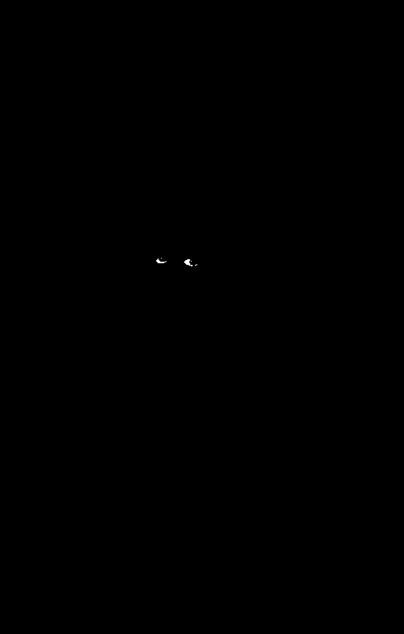
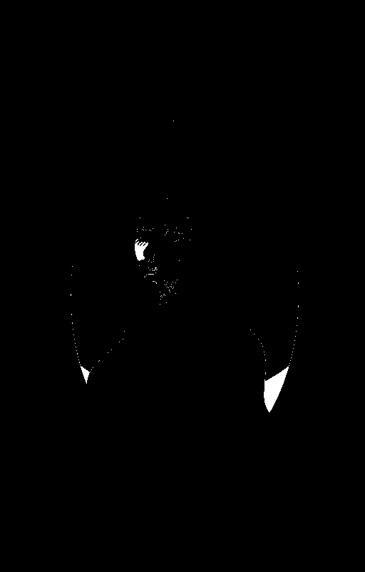
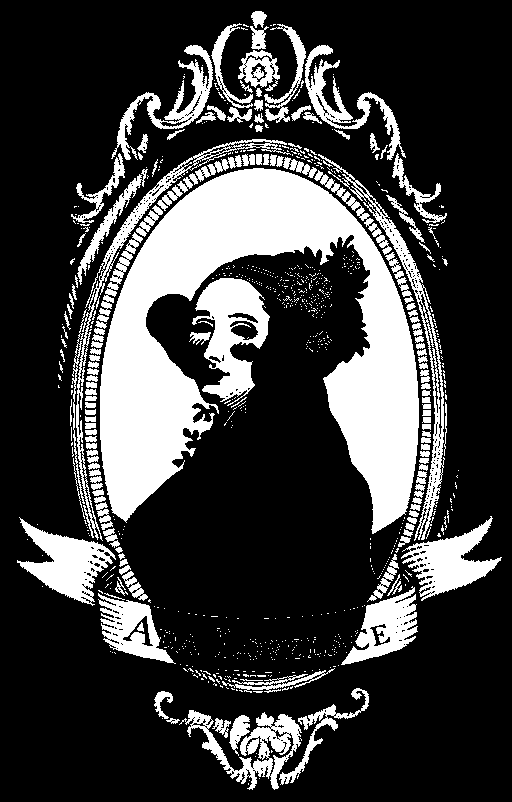
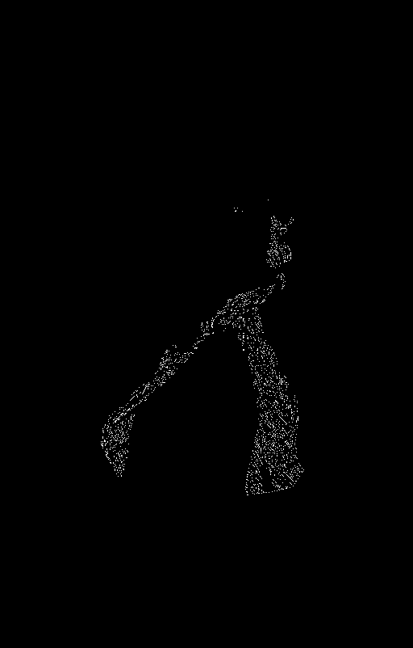
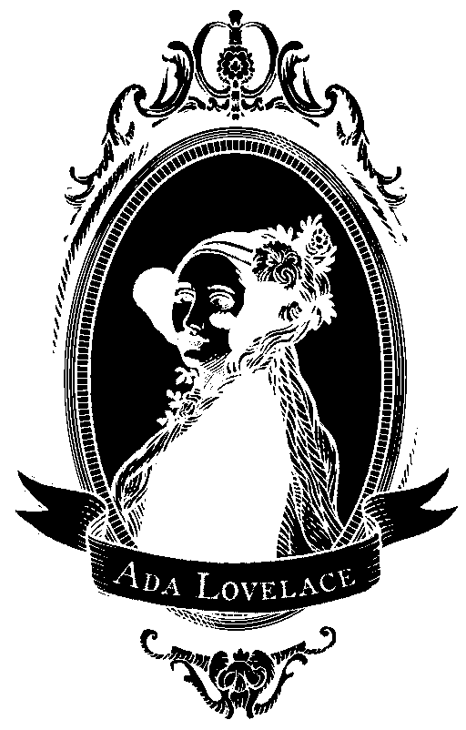
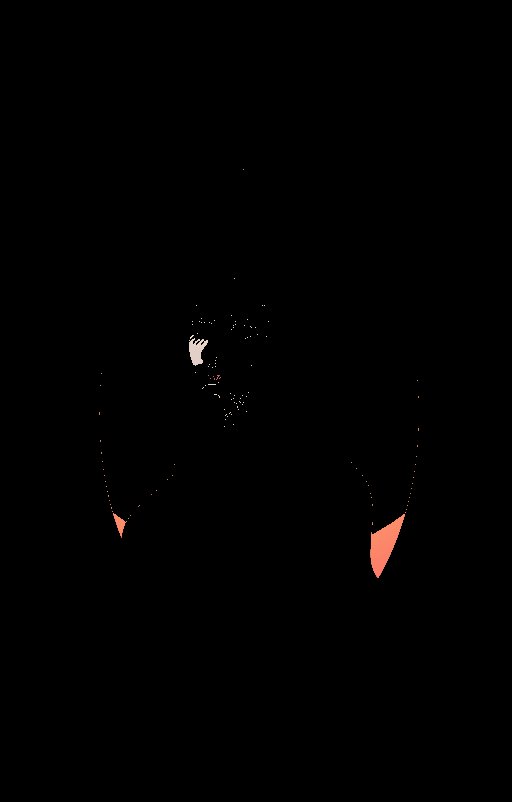
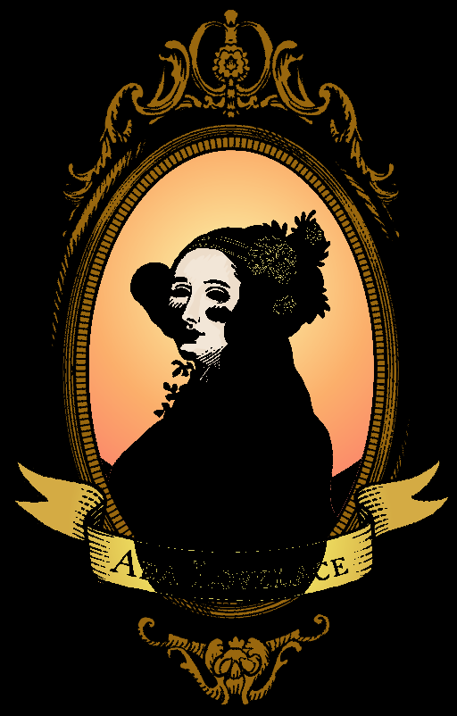
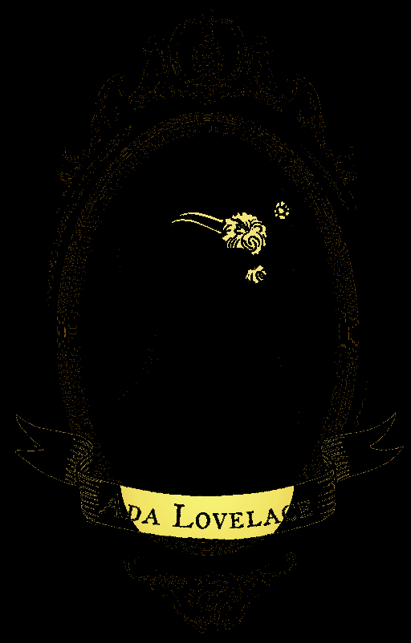

# Color-extraction

Color-extraction is an open-source python module which attributes to each element of an ndarray (RGB image) the most similar color from a palette of predefined colors.

Three functions are included, each of which takes an RGB ndarray as input and returns a dict whose keys are the names of each predefined colors:

Function | Values of returned dict
--- | ---
[`get_bool_arrays`](#boolean-array) | boolean ndarrays (1 per color)
[`get_rgb_arrays`](#rgb-arrays) | RGB ndarrays (1 per color)
[`get_counts`](#counts) | integer counts of pixels (1 per color)

## Installing

```
>>> pip install color_extraction
```

## Usage examples

A predefined set of colors is included in the module with ten colors: red,
orange, yellow, green, cyan, blue, purple, pink, achromatic (gray and black),
and white. This set of colors, which can be modified, is available at
[https://github.com/ChrisCocco/ddd_colours/blob/master/color_extraction/color_definitions.json](https://github.com/ChrisCocco/ddd_colours/blob/master/color_extraction/color_definitions.json).

To get started:
```
>>> import color_extraction
>>> import matplotlib
>>> import matplotlib.pyplot

>>> with matplotlib.cbook.get_sample_data('ada.png') as image_file:
... img = matplotlib.pyplot.imread(image_file)
```

### Boolean arrays

The function `get_bool_arrays` returns a dictionary with a boolean ndarray for each color. Each such array has the same horizontal and vertical dimensions as the source image and can be thought of as a *mask* for the color in question.

```
>>> dict_bool_arrays = color_extraction.get_bool_arrays(img)

>>> for color in dict_bool_arrays.keys():
    matplotlib.image.imsave(output_path+color, dict_bool_arrays[color], cmap='gray')
```

Original image| white | red | orange
--- | --- | --- | ---
 | |  | 
yellow | green | cyan | blue
|||
purple  |pink | achromatic
||

It is also possible to use a median filter (3 x 3) in order to reduce the amount of pixels of a given color that are isolated in the array:

```
>>> color_extraction.get_bool_arrays(img, median_filter=True)
```

It is also possible to use your own color definitions saved in a JSON file.

```
>>> color_extraction.get_bool_arrays(img, color_def_path=path_to_your_json_file)
```

### RGB arrays

The function `get_rgb_arrays` returns a dictionary with a RGB array for each color. Each such array has the same horizontal and vertical dimensions as the source image. Positions where the color in question has been detected contain the original RGB color found in the source image; other positions have the value 0 (black), except in the case of the "achro(matic)" color, where they have the value 1 (white).

```
>>> dict_rgb_arrays = color_extraction.get_rgb_arrays(img)

>>> for color in dict_rgb_arrays:
... matplotlib.image.imsave(color, dict_rgb_arrays[color])
```


Using the following image as input:

Original image| white | red | orange
--- | --- | --- | ---
 | |  | 
yellow | green | cyan | blue
|||
purple  |pink | achromatic
||

Similarly to [`get_bool_arrays`](#boolean-array), it is possible to use a median filter and/or your own color definition set, with the same parameters (`median_filter` and `color_def_path`).

### Pixel counts

The function `get_counts` returns a dictionary with the number of pixels of each colour.

```
>>> color_extraction.get_counts(img)
{'purple': 25, 'blue': 6652, 'achro': 2477505, 'cyan': 764, 'white': 9567, 'green': 185, 'red': 114555, 'pink': 163, 'orange': 150263, 'yellow': 5121}
```
Similarly to [`get_bool_arrays`](#boolean-array), it is possible to use your own color definition set, with the same parameter (`color_def_path`). The median filter is not available for this function.

## Dependencies

* scipy.cluster.vq
* skimage.filters
* numpy

## Authors

* [Christelle Cocco](https://github.com/ChrisCocco) - initial implementation
* [Raphaël Ceré](https://github.com/raphaelcere) - contributor
* [Aris Xanthos](https://github.com/axanthos) - refactoring

## Credits
This module was partially funded by the the Swiss National Science Foundation (SNSF), grant N° CR11I1_156383.

The current version (0.1a0) was implemented by Aris Xanthos based on the original code by Christelle Cocco available [here](color_extraction/fct_palette_man_RGB.py).

To cite: [Cocco, C., Ceré, R., Xanthos, A., Brandt, P.-Y. 2019. _Identification and quantification of colours in children's drawings_. Workshop on Computational Methods in the Humanities 2018. pp. 11-21. Vol. 2314. CEUR Workshop Proceedings](http://ceur-ws.org/Vol-2314/paper1.pdf)

## License

This project is licensed under the GNU General Public License v3 - see the [LICENSE](LICENSE) file for details.
